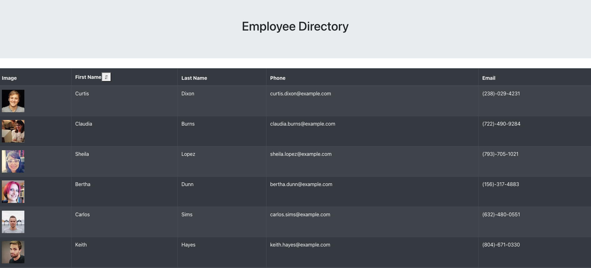

# Employee Directory

## Table of Contents

- [Description](#description)
- [Mock Up](#mock-up)
- [Installation](#installation)
- [Usage](#usage)
- [License](#license)
- [Contributing](#contributing)
- [Tests](#tests)
- [Questions](#questions)

## Mock-Up

The following picture demonstrates the application functionality:

## Description

## Installation

For link to Web App click [here](https://employee-directory-ms12.herokuapp.com/)

## Usage

## License

- [License File](./LICENSE.txt)

## Contributing

Feel free to fork and improve!

## Tests

NodeJS

## Questions?

- Msas12: https://github.com/Msas12
- m5455y@gmail.com
